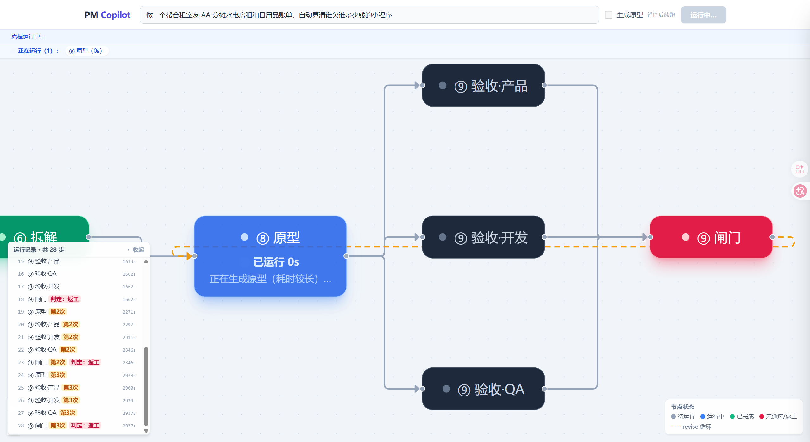
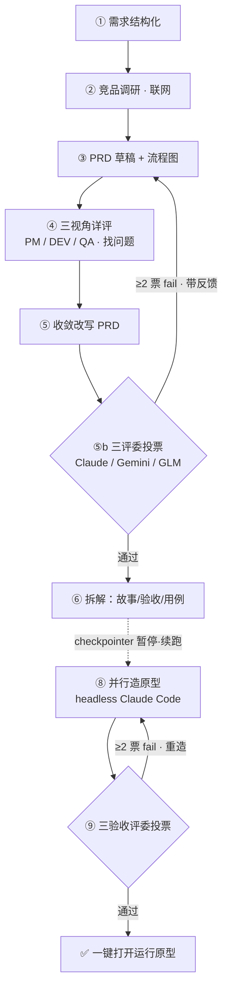

# 🧭 PM Copilot

> 基于 Anthropic [《Building Effective Agents》](https://www.anthropic.com/research/building-effective-agents) 的**产品经理副驾**：输入**一句话需求**，自动跑完 **调研 → PRD → 三家异构 AI 对抗评审与投票 → 拆解 → 生成可运行原型 → 验收**，全程在一张**实时活图**上可视化，可暂停续跑、可一键打开运行原型。

**技术栈**：`LangGraph` · `GLM-5.1 / Claude / Gemini`（异构评委）· `FastAPI (SSE)` · `React Flow` · `Python 3.12`

---

## 📸 预览



> _截图位_：运行起来后把 React Flow 活图截一张图，存为 `docs/screenshot.png` 即可在此显示（`mkdir docs` 后放进去，`git add docs/screenshot.png && git commit && git push`）。

---

## ✨ 亮点

- **不是放养式 Agent，是可控 Workflow。** 严格按 BEA 的可控编排模式（Prompt Chaining / Parallelization / Evaluator-Optimizer / Orchestrator-Workers）用 LangGraph 显式编排，每步输入输出**可观察、可复现**；并能讲清「为什么外层是 workflow、唯独造原型那步放手给 agent」。
- **三家异构模型并行评审。** 9 个「评委」按视角路由到 **Claude / Gemini / GLM** 三个不同实验室的前沿模型（任一不可用自动回退 GLM），盲点不相关——实测出现过 **2:1 的真分歧**，治了「同源评委自评自证」的相关误差。
- **两条评审回路 + 收敛即止。** PRD 经三评委投票，≥2 票不过就**带反馈回炉重写**；原型经三验收评委投票，不过就**返工重造**。闸门用「较上轮无改善即止」防止烧光预算。
- **可暂停续跑 / Human-in-the-loop。** 跑到 PRD 后用 LangGraph `checkpointer` + `interrupt` **暂停存档**，由你决定是否生成原型；续跑**从存档继续、不重跑 PRD**，原型必基于你审过的那一版。
- **真能打开运行的原型。** ⑧ 用 headless coding agent（Claude Code）**并行造**单文件原型，一键在浏览器打开交互。
- **实时活图。** FastAPI SSE 把每个节点的执行流式推给前端，React Flow 上**节点逐个点亮、评委红绿分歧、回路转回去重跑**，左下角时间线数得出返工了几轮。
- **附带两个真实 debug 故事**（见 `DESIGN.md` §12）：Windows 下 headless agent 卡授权的根因（多行 spec 经 `cmd /c` 把 flag 冲掉 → 改走 stdin）；SSE 在循环处崩于 `↻` 的 GBK 编码——都是「从表象一路查到系统级根因」的料。

---

## 🏗️ 架构总览



> 完整设计、BEA 模式对照、里程碑进度、踩坑记录见 **[`DESIGN.md`](DESIGN.md)**；示例运行报告见 `sample_run_m1/m2/m4.md`。

---

## 🚀 快速开始

环境：**Python 3.12** + **Node.js**。至少需要一个大模型 key（GLM via [Z.AI](https://z.ai)）；异构评委额外需要本机装好 Claude Code / Gemini CLI（可选，缺失会自动回退 GLM）。

```bash
# 1) 后端
cd pm-copilot
python -m venv .venv
.venv\Scripts\activate                 # macOS/Linux: source .venv/bin/activate
pip install -r requirements.txt
copy .env.example .env                  # 然后编辑 .env 填入 ZAI_API_KEY（macOS/Linux: cp）
python server.py                        # → http://127.0.0.1:8000

# 2) 前端（另开一个终端）
cd web
npm install
npm run dev                             # → http://localhost:5173
```

浏览器打开 **http://localhost:5173**，输入一句话需求 → 点「运行」看活图跑起来。开「生成原型」开关可一路跑到原型；关掉则跑到 PRD 暂停，再点「▶ 生成原型（续跑）」从存档续跑。

也可纯命令行：

```bash
python main.py "你的一句话需求"               # 跑到 PRD 暂停，打印 thread_id
python main.py --resume <thread_id>           # 从存档续跑生成原型（不重跑 PRD）
python main.py "需求" --prototype --md out.md  # 一气呵成并导出 markdown 运行报告
```

`.env` 变量：`ZAI_API_KEY`（必填）/ `ZAI_BASE_URL`（默认 `https://api.z.ai/api/paas/v4`）/ `GLM_CHAT_MODEL`（默认 `glm-5.1`）。评委路由可选覆盖：`PM_JUDGE_PM` / `PM_JUDGE_DEV` / `PM_JUDGE_QA`。

---

## 回路怎么走（两组评委，易混）

图上有**两组评委**，角色不同：

- **④ 详评** `critic_pm/dev/qa`：**找问题**（列 issue）。**每轮都**喂给 ⑤ `converge`，由它改写 PRD——不分过不过。
- **⑤b 终审** `eval_pm/dev/qa`：**投票**（pass/fail）。**≥2 票 fail 才触发回退**。

回退重写数据流：`⑤b ≥2 fail → eval_gate 判 revise（红）→ 回退 ③ prd_draft（重新运行）→ prd_draft 带【上一版 PRD + 投 fail 评委的 reasons】定向重写出新一版 → 再走 ④→⑤→⑤b……直到放行 / 收敛即止 / 到上限`。⑨ 验收回路同构（accept 投票 → 不过则回 ⑧ 重造原型）。

要点：**触发回退的是 ⑤b 投票评委**（不是 ④ 详评）；**“出新一版 PRD” 发生在 ③ prd_draft**（拿反馈重写），不是 converge。详见 `DESIGN.md` §13。

---

## 已知局限与改进方向

> 这是一个**能力演示**（展示 Agent 编排 / BEA 范式 / 系统级 debug），不是开箱即用的生产工具。清楚它的边界，本身就是工程判断力的一部分。

1. **没有真实上下文接地（grounding）——最致命。** 它不知道你公司的代码库、现有产品、团队、排期、历史决策、真实用户。产出的 PRD 读着漂亮却「放之四海皆准」，恰恰说明没解决任何具体问题。`②调研` 只是浅层网搜。
   *改进*：接公司 Confluence / Jira / 代码库 / 用户反馈做 RAG，让评审能说出「这和上季度那条冲突了」这种只有内部人知道的话。

2. **自评自证，鲁棒性是假象。** 三评委、三 critic 原本全是同一个 GLM 自言自语，同源判断高度相关，多数票并不比单票可靠多少。
   *已部分改进*：现已把 9 个评委按视角路由到**异构 CLI**（PM→Claude · DEV→Gemini · QA→Codex；缺失/失败自动回退 GLM），三个不同实验室的前沿模型并行裁决，盲点不再相关——实测出现过 Claude/Gemini 放行、GLM 否决的 **2:1 真分歧**。但仍是 LLM 判 LLM，且 grounding 缺口（#1）让它们可能「异口同声地错」，根治还需真人 / 真实测试做 ground truth。

3. **循环不保证收敛。** 评委（尤其同源时）几乎总能挑出 fail，回路容易打满预算而非真改好；实测还出现过「越改越差」。
   *已部分改进*：M4 把闸门从「还有 fail 就返工」改成**收敛即止**（通过 / 到上限 / 较上轮未改善任一即停），实测把「撞预算」变成了「检测到退化即叫停」；异构评委的真分歧也缓解了「众口一词永不收敛」。但仍是治标，根治需更强的 gate 与人审。

4. **原型是一次性 mock，会制造虚假信心。** ⑧ 出的是单文件假数据 HTML，没后端、没真可行性、没真人用过；⑨ 是宽松判（核心 happy-path 即通过）。看着能跑 ≠ 方案被验证。
   *改进*：接真用户测试 / 真功能验证，把「界面长这样」和「这事能不能成」分开。

5. **成本 / 延迟 / 不确定。** 一次跑十几到几十次 LLM 调用，开原型那条要调多次 claude（每次几分钟）；同样需求每次产出不同。
   *改进*：中间产物缓存、小模型分流、对结构化部分加确定性约束。

6. **没有人在环，PM 插不上手。** 一次性发射、中途无法干预。
   *已解决*：用 LangGraph `checkpointer`(SqliteSaver) + `interrupt`，管线跑到拆解后**暂停存档**，由人决定是否续跑造原型；续跑**从存档继续、不重跑 PRD**，原型必基于已审的那份 PRD。既是 human-in-the-loop，也解决了「重跑会得到一份没审过的新 PRD」的一致性问题。剩余：`open_questions` 尚未做成可回答的交互。

7. **coding agent 无沙箱。** ⑧ 用 `--dangerously-skip-permissions` 在隔离目录里跑 claude，demo OK，生产化必须容器隔离。

8. **形式严谨可能掩盖实质平庸。** 它会产出结构精美、篇幅可观、看着很专业的东西，但底层判断可能很浅。**当辅助用，别当权威。**

---

<sub>用 LangGraph 编排，遵循 Anthropic《Building Effective Agents》范式。设计与踩坑全记录见 [`DESIGN.md`](DESIGN.md)。</sub>
